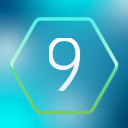

[**IxiBot**](https://bitbucket.org/ShadowHawk54/ixibot) is an open source chat bot for Twitch and Discord.
IxiBot also features integration with Discord, YouTube, and Twitter.

IxiBot is a self-hosted bot, meaning that you have to download and run the bot on your own hardware.

## How do I contribute?

 You don't.
 
 IxiBot is open source so you're welcome to fork it and maintain a version with your own changes, but we do not accept pull requests.
 
## Requirements

IxiBot requires the following software to be installed:

* [Java 8](https://www.oracle.com/technetwork/java/javase/downloads/jre8-downloads-2133155.html)