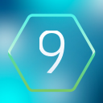

# [IxiBot](https://github.com/Ixirsii/IxiBot)

IxiBot is an open source chat bot for Twitch and Discord.

IxiBot is a self-hosted bot, meaning you have to download and run the bot on your own hardware.

## How do I contribute?

 You don't.
 
 IxiBot is open source, so you're welcome to fork it and maintain a version with your own changes, but we do not accept pull requests.
